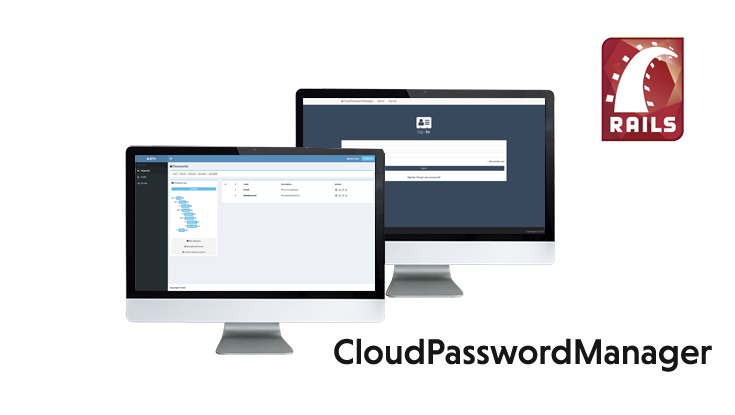

# CloudPasswordManager 1.0.0



The CloudPasswordManager is a rich web application that provides you password manager. The application was created in Ruby on Rails and UI part is written in Javascript.

[Screenshots](Screenshots/)

## Installation

* Install all necessary ruby gems `bundle install`
* Install all necessary bower packages `bower install`
* Setup a database connection `vim config/database.yml`

## Setup

* Create a database `bundle exec rake db:create`
* Migrate database tables `bundle exec rake db:migrate`
* Populate a database `bundle exec rake db:seed`

## Requirements

* Ruby on Rails 5
* SQLite3 / PostgreSQL

## Run application

* `rails s`

## Run RSpec tests

* `bundle exec rspec`

## Libraries

 * [Bower](https://bower.io/) - A package manager for the web development
 * [Twitter Bootstrap](https://github.com/twbs/bootstrap-sass) - Twitter Bootstrap for Sass
 * [AdminLTE](https://adminlte.io/) -  A control panel template for Twitter Bootstrap
 * [jQuery](https://jquery.com/) - jQuery is a fast, small, and feature-rich JS library
 * [Font Awesome](http://fontawesome.io/) - The iconic font and css toolkit
 * [Rails Internationalization (I18n) API](http://guides.rubyonrails.org/i18n.html) - Rails framework for translation applications
 * [Devise](https://github.com/plataformatec/devise) - Flexible authentication solution for Rails with Warden
 * [Doorkeeper](https://github.com/doorkeeper-gem/doorkeeper) - Doorkeeper is an OAuth 2 provider for Rails
 * [RSpec](http://rspec.info/) - Behaviour Driven Development for Ruby

# License - Apache License, Version 2.0

```
# (C) Copyright 2017 by Marek Hakala <hakala.marek@gmail.com>
# Licensed under the Apache License, Version 2.0 (the "License");
# you may not use this file except in compliance with the License.
# You may obtain a copy of the License at
#
# http://www.apache.org/licenses/LICENSE-2.0
#
# Unless required by applicable law or agreed to in writing, software
# distributed under the License is distributed on an "AS IS" BASIS,
# WITHOUT WARRANTIES OR CONDITIONS OF ANY KIND, either express or implied.
# See the License for the specific language governing permissions and
#    limitations under the License.
```
